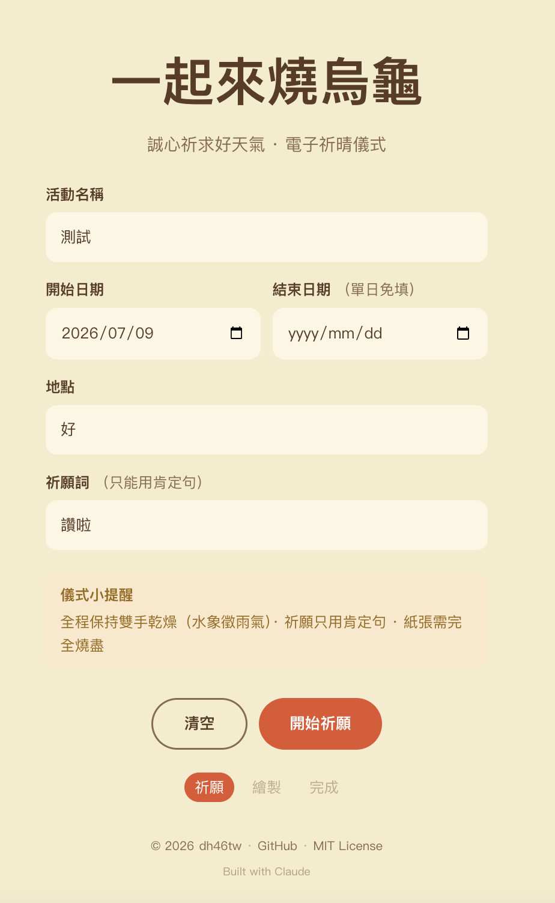
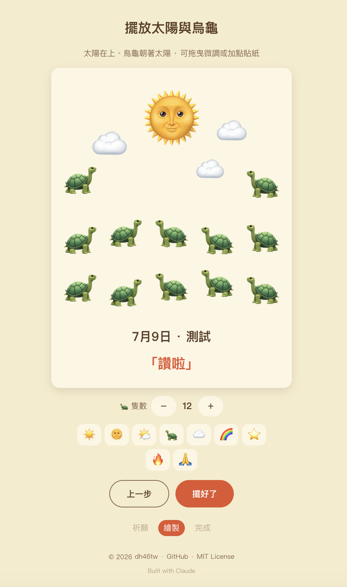

# 🐢 Burn Turtles for Good Weather

> 繁體中文說明 → [README.zh-TW.md](./README.zh-TW.md)

An online **turtle-burning** ritual — a light-hearted web toy for praying for good
weather. Fill in your event, arrange sun-and-turtle stickers on a sheet of paper,
then watch it burn away to send your wish for clear skies. No real fire, no real
turtles: just a bit of digital peace of mind. ☀️

**Live demo:** https://dh46tw.github.io/burn-turtles-for-good-weather/

|||
|---|---|

## What is "burning turtles"?

"Burning turtles" (燒烏龜) is a good-weather ritual popular in Taiwan and the wider
Chinese-speaking world. The name is a pun: 烏龜 (*turtle*) sounds like 烏雲歸去
(*"let the dark clouds depart"*). Traditionally you draw a sun and a turtle — its
head always facing the sun — on a clean sheet of paper, write down the event, date
and a wish phrased only in the positive, then burn the paper completely to chase the
rain clouds away.

This project is a digital, eco-friendly version of that ritual.

## Features

- **Five-step ritual flow** — prepare → arrange → meditate → burn → done.
- **Wish validation** — only positive phrasing is accepted; the character 雨 (*rain*)
  and other negative words are blocked, faithful to the ritual's taboo.
- **Multi-day date range** — start/end dates for events that span several days.
- **Emoji sticker composer** — a fixed sun on top, a few clouds ("parting clouds to
  reveal the sun"), and a spread of turtles along the bottom that always face the sun.
  Turtle count is adjustable with no upper limit; add / drag / resize / delete stickers.
- **Noise-dissolve burning animation** — a Canvas particle engine burns the paper away
  from the bottom up in an irregular, crumbling pattern, with a glowing ember front,
  rising flames and drifting ash.
- **Shareable result card** — save or share a completion image.
- **Form memory** — remembers your last entry via `localStorage`.
- **Bilingual (中文 / English)** — a lightweight, rune-based i18n scheme with no library.
  The language switcher lives in the footer; the initial locale is detected from
  `localStorage` then the browser language. Even the wish taboo is localized — `zh-TW`
  blocks 雨 (*rain*), while `en` blocks the word "rain" but lets "rainbow" through.
- **Installable PWA** — installable to the home screen and openable offline. Built with
  [`vite-plugin-pwa`](https://vite-pwa-org.netlify.app/): an auto-updating service worker
  precaches the build, and the app icons are generated from a single ☀️🐢 emoji image.
- **Responsive** — works on phone, tablet and desktop.

## Tech stack

- [Vite](https://vitejs.dev/) 6
- [Svelte](https://svelte.dev/) 5 (runes)
- TypeScript
- HTML Canvas 2D (drawing composition + fire engine), no backend
- [vite-plugin-pwa](https://vite-pwa-org.netlify.app/) (installable + offline PWA)

## Getting started

```bash
npm install
npm run dev      # http://localhost:5173
npm run build    # type-check (svelte-check) + production build to dist/
npm run preview  # preview the production build locally
```

## Deployment

Pushing to `main` triggers a GitHub Actions workflow
([`.github/workflows/deploy.yml`](./.github/workflows/deploy.yml)) that builds the site
and publishes `dist/` to GitHub Pages.

First-time setup: in the repo, go to **Settings → Pages → Build and deployment →
Source** and choose **GitHub Actions**. Vite's `base` is set to a relative path, so the
build works both on a project page (`user.github.io/repo`) and on a custom domain.

## Project structure

```
src/
├─ App.svelte            # five-step state machine + transitions + footer
├─ app.css               # theme variables + responsive base
├─ lib/
│  ├─ types.ts           # Step / WishData types
│  ├─ stores.svelte.ts   # global ritual state (runes)
│  ├─ validation.ts      # wish validation (positive-only, localized taboo)
│  ├─ format.ts          # date-range formatting
│  ├─ storage.ts         # localStorage form memory
│  ├─ i18n.svelte.ts     # locale store (runes) + detection/persistence
│  ├─ messages.ts        # zh-TW / en UI dictionaries (one Messages type)
│  └─ Footer.svelte      # footer + language switcher
├─ steps/                # one component per step
│  ├─ StepForm / StepDraw / StepPray / StepBurn / StepDone.svelte
└─ canvas/               # framework-agnostic pure TS
   ├─ stickers.ts        # sticker model + emoji palette + turtle layout
   ├─ exportPaper.ts     # compose paper (bg + stickers + text) → PNG
   ├─ resultCard.ts      # shareable completion image
   └─ FireEngine.ts      # noise-dissolve burning animation
```

## License

[MIT](./LICENSE) © 2026 dh46tw

## Credits

Built with Claude.
